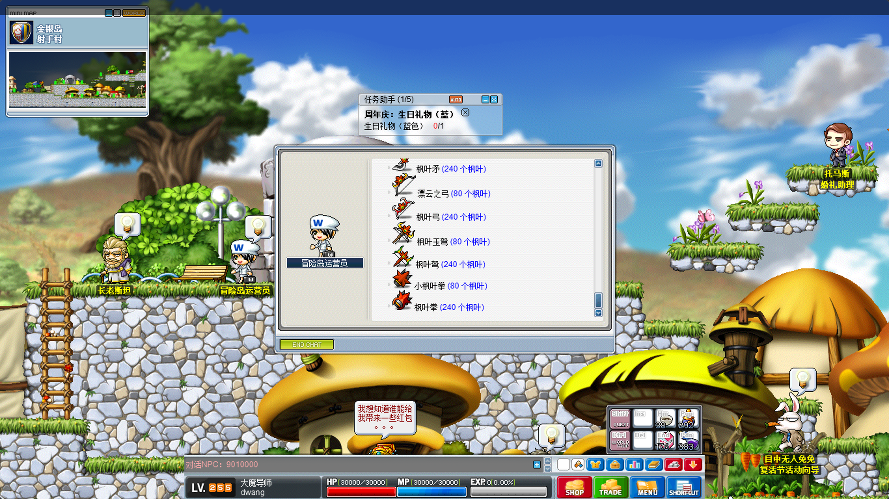
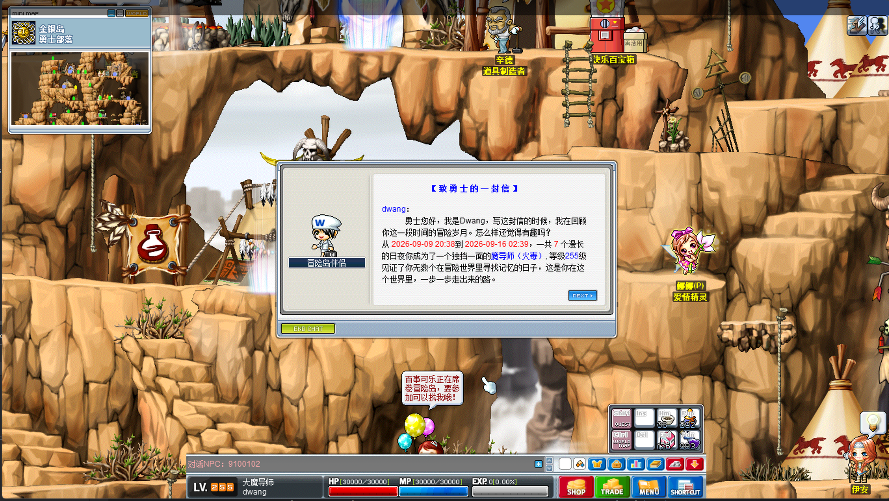
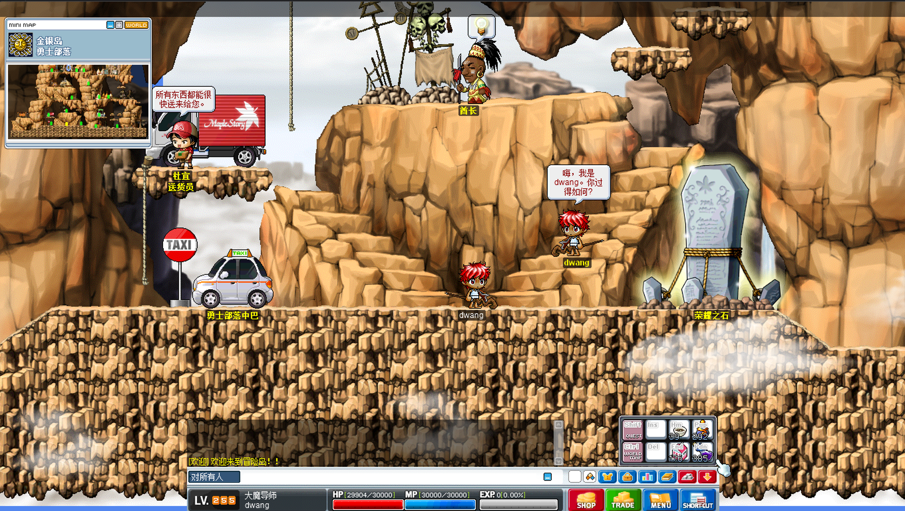
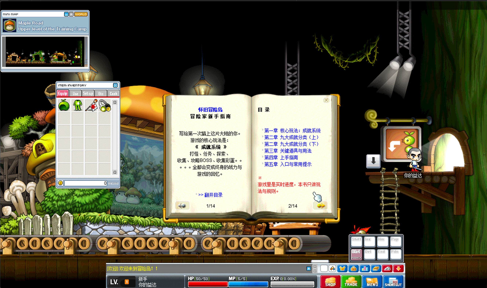

# v1.0.0 —— 原生冒险 · 成就系统

> *"MapleStory is not merely a game; it is a cherished memory."*
> *（冒险岛不仅仅是一款游戏，更是心中珍藏的回忆。）*

---

## 📌 这个项目是什么

**GMS v053 服务端**：基于 **北斗（v083）架构**二次开发的国际服（Global MapleStory）服务端，目标是**精准还原早期国际服那份纯粹、干净的冒险体验**——摇骰子决定属性、经典四大职业、四转技能体系、原生任务与掉落机制，一个都不改。

- 语言 / 框架：Java 21 · Spring Boot · MyBatis-Flex · Netty · GraalVM JS 脚本引擎
- 数据库：兼容北斗 MySQL 结构，附带数据迁移脚本
- 脚本体系：NPC / 任务 / 活动全部走脚本层，支持中英双语文案目录（`scripts` / `scripts-zh-CN`）

---

## 🎯 设计理念：只还原，不魔改

做这个版本的初衷很简单：**找回一点曾经的回忆，而不是再做一个"特色服"。**

- ❌ **不做技能魔改**，不提高伤害上限，不做数值膨胀，不做一键挂机、自动寻路
- ❌ 已剔除上游的非原生内容（北斗特色物品、北斗书、回退卷轴等自定义道具）
- ✅ 保留原生的一切"麻烦"：摇骰子、掉经验、强化会失败、装备会爆炸
- ✅ 全系统任务汉化并去除过期时间，单人也能够完整攻略
- ✅ 修复上游存在问题的封包反序列化与技能处理句柄（详见 `doc/skill_log.md`）
- ✅ 为**单人正常游玩**只做了极少量"工具性"微调，全部是便利功能，不碰战斗数值

一句话：**如果你想要特色魔改，这个版本不适合你；如果你想要的是记忆里的那个冒险岛，那它就是了。**

---

## 🏆 本版重点：成就系统

这是 v1.0.0 的核心内容。整套系统只做两件事：**给你一个长久玩下去的理由，以及替你把走过的路记下来。**

### 荣誉之石（成就面板）
- **九大成就分类**：怪物击杀、任务完成、组队任务、音乐收集、隐藏地图探索、抽奖、NPC 拜访、区域 BOSS 征服、隐藏彩蛋
- 每个分类显示实时进度 / 目标、完成度，以及该分类为你折算的**怪物血量减免**（成就越高，野外怪物血量越低，纯 PvE 便利，不改变职业强度）
- 区域 BOSS 按**区域**独立统计，可查看每个区域内每一只 BOSS 的讨伐情况
- 达成成就时会在游戏内收到粉色提示，不会刷屏、不强打断

### 成就解锁的是"便利"，不是数值
- `#i5230000#` **掉落查询**：可直接检索当前地图的掉落
- `#i1702050#` **远程通话**：可直接联系拜访过的 NPC
- `#i1002747#` **音乐点播**：收集过的 BGM 随时随地播放
- `#i5041000#` **地图存储**：可保存更多地图，方便飞行
- 任务完成度达标后可**重置指定任务**；组队任务、抽奖达成后解锁**枫叶兑换折扣 / 自选奖池**等

### 除了成就，它还在默默记录
服务端在后台静默统计了一批**不计入成就、不影响任何平衡**的数据：走过的地图、用过的技能、消耗品、地上捡起与任务获得的物品等等。它们不给属性、不给奖励，只是记着。

### 全部达成之后
九大分类全部拉满后会解锁**属于你的终极礼物**——具体是什么，请自行体验，这里就不剧透了。 :wink:

### 还有藏起来的部分
世界里散落着若干**隐藏彩蛋**，不在任务列表里，也不会有人提醒你。找得到是你的本事，找不到……也正常。成就面板会给一点点提示。

---

## ⚖️ 原生限制说明（玩之前请先了解）

1. **NPC 交互**：需严格双击 NPC 触发对话，本版本不支持空格键交互
2. **地图范围**：暂不包含 CMS 特有的上海地图
3. **宠物系统**：遵循原生单宠物装备规则，不可同时装备多只
4. **人物动作**：原生暂不支持下跳（`下 + 跳`）
5. **角色栏位**：保持原生 3 个角色栏
6. **掉落概率**：野外任务道具掉落率会根据实际体验动态调整
7. **技能效果**：客户端本身存在 BUG 导致导入后无法显示的技能，采用相似技能逻辑替代实现，以匹配技能描述与效果

---

## 🐛 已知问题

- [ ] **宠物过滤**：尚未修复/验证（该版本协议中似乎缺失相关逻辑）
- [ ] **状态掩码**：部分 `MapleBuffStat` 位掩码值仍在进一步测试与确定中
- [ ] **脚本事件**：当前已关闭所有副本与地图脚本事件，等待后续统一修复与重构

---

## 📜 相关文档

- 📖 [技能修复日志](doc/skill_log.md)
- 🛠️ [更新与修复日志](doc/update_log.md)
- 🗄️ [数据库结构差异](doc/db_diff.md)

---

## 🙏 致谢

- 上游开源项目：[BeiDou-Server](https://github.com/BeiDouMS/BeiDou-Server)
- 感谢所有无私分享经验与代码的技术朋友。特别致谢：**Zhyon**、**白牛**
- 以及每一个还愿意回来走走停停的冒险家——**感谢你喜欢这个游戏。**

---

## 🔮 下一步

- [ ] 包头修复
- [ ] 代码重构与性能优化
- [ ] 大厅式组队模式：平时单机探索，组队大厅中一起攻略 PQ 与 BOSS

## 游戏截图

  
  
  
  
  
  
  
  

