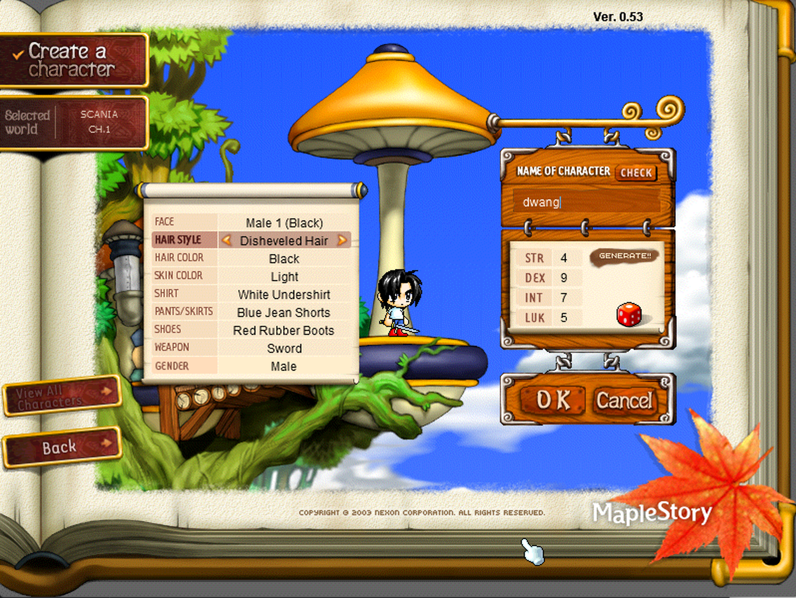

# GMS v053 (Base v083) Server Emulator

Language / 语言: [English](README.md) | [中文](README-CN.md)

> *"MapleStory is not merely a game; it is a cherished memory."*

---

## 📌 Overview

**GMS v053** is a MapleStory Global server emulator based on the **BeiDou (v083)** architecture.

The primary goal of this project is to recreate the authentic, nostalgic feeling of early Global MapleStory—featuring classic character stats rolling, the original 4 Explorer job branches (*Warrior, Magician, Thief, Bowman*), 4th job advancement skills, and vanilla game mechanics—while maintaining a clean codebase for packet analysis and reverse engineering.

---

## 🎯 Project Objectives

1. **Vanilla Memory Restoration**: Faithfully restore the classic childhood MapleStory experience. Compared to standard custom v083 sources, this project strips away modern bloat and restores the pure v053 atmosphere.
2. **Protocol & Packet Analysis**: Deepen understanding of low-level client handling, packet structures, and state masks to lay a solid foundation for fixing client/packet bugs in higher version emulators.

---

## 🖼️ Screenshots

  
  

---

## 🚀 Quick Start & Setup Guide

### Prerequisites & Downloads
* **Database**: Compatible with BeiDou MySQL Schema
* **Server Source**: This repository
* **Client**: [GMS v053 Client Downloads](https://msdl.xyz/pages/gms/Clients)
* **Client Launcher / Bypass**: Local clean client launcher (No-blast / Bypass):
  * 🔗 [Download Launcher via MEGA](https://mega.nz/file/Oc0RXBSL#1S-IvbFKs_7eZ2NzEtQhaC_lKrhpaksN59IiID-XFoc)

---

## ⚖️ Design Mechanics & Vanilla Constraints

1. **100% Pure Vanilla Gameplay**: Zero custom items, custom NPCs, or overpowered game modifications.
2. **Map Scope**: CMS-exclusive maps (such as Shanghai) are excluded for now (may be considered later).
3. **NPC Interaction**: Triggered strictly via double-clicking (spacebar interaction is disabled/unsupported in this version).
4. **Pet System**: Standard single pet equipment rules (multi-pet equipping disabled).
5. **Drop Rates**: Quest item field drop rates are fine-tuned dynamically as needed.
6. **Movement**: Down-jump (`Down + Jump`) is not implemented natively (potential client/plugin adjustments evaluated for future updates).
7. **Character Creation**: Standard character creation slots default to **3**.
8. **Skill Workarounds**: Addressed client-side rendering bugs for unrenderable skills by substituting similar skill implementations to achieve the intended skill mechanics and descriptions.

---

## 🐛 Known Issues & Roadmap

### Known Issues
- [ ] **Pet Item Filter**: Currently unverified or unimplemented in v053 protocol.
- [ ] **Stat Mask Flags**: Several `MapleBuffStat` bitmask values are still being analyzed.
- [ ] **Script Events**: All world script events are currently disabled pending complete overhaul and refactoring.

### Differences from Upstream (BeiDou)
* **Stripped Custom Content**: Removed custom items, BeiDou-specific scrolls, and rollback scrolls.
* **Map & Script Cleanup**: Removed invalid map transitions and script events associated with non-standard jobs.
* **Packet Parsing Fixes**: Corrected invalid packet deserialization present in upstream source.
* **Skill Logic Overhaul**: Resolved execution errors and calculations across multiple skill handlers.
* **Fame Reward System**: Retained `quest_point_per_quest_complete` to grant Fame upon quest completion.

---

## 📜 Documentation

* 📖 [Skill Fix Logs](doc/skill_log.md)
* 🛠️ [Update & Patch Logs](doc/update_log.md)
* 🗄️ [Database Schema Differences](doc/db_diff.md)

---

## 🔮 Future Vision

- [ ] **Code Refactoring**: Remove redundant logic checks and optimize server runtime performance.
- [ ] **Localization & Resolution**: Full Chinese client translation and modern high-resolution client porting.
- [ ] **Lobby-based Co-op Concept**: Explore a hybrid multiplayer model—players enjoy offline/single-player progression for solo exploration, with a shared online lobby for Party Quests (PQ) and Boss Raids.

---

## 🙏 Acknowledgements

* Upstream Project: [BeiDou-Server](https://github.com/BeiDouMS/BeiDou-Server)
* Special thanks to all community members who generously share their knowledge. Special shoutout to: **Zhyon**