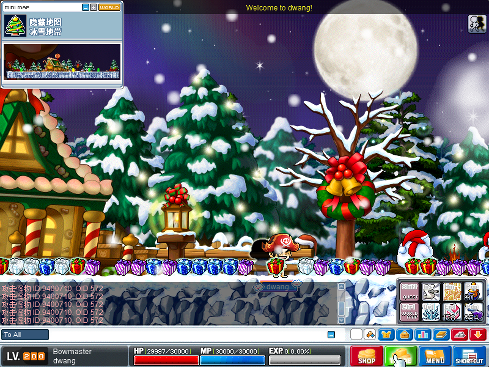
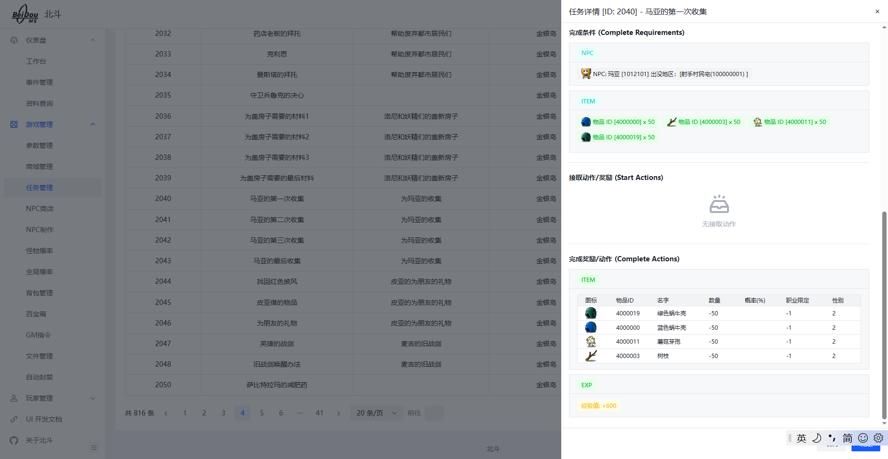
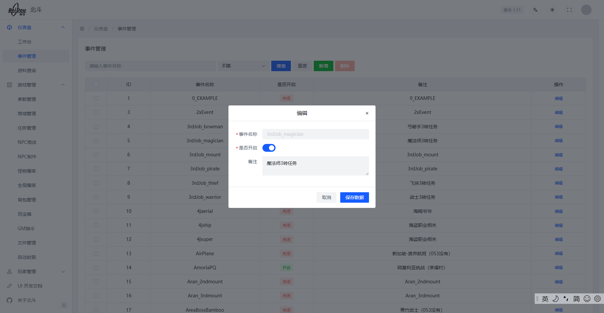
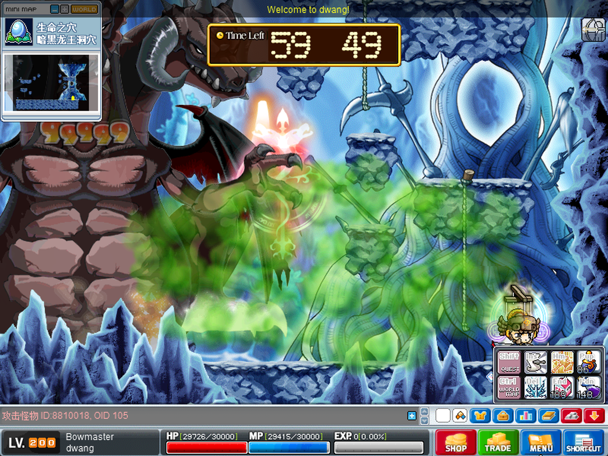

## 20260831
1. 修复完整的圣诞节雪球活动

2. 修复九灵龙蛋任务因版本差异无法兑换黑龙项链使用的卷轴问题
3. 从BMS的掉落文件同步掉落。详情查看：``` origin.DropServiceTest```
```sql
-- 需要修改表结构。当前表结构是单个droperId和itemId是组合键。无法适配同一个DropperId掉落多个相同ItemId的情况，而且这多个掉落概率是不一样的，不知道官方为什么这么设计
-- 需要修改表结构如下：
ALTER TABLE drop_data DROP INDEX dropperid;
-- 2. 删除重复/冗余的索引
ALTER TABLE drop_data DROP INDEX dropperid_2;
ALTER TABLE drop_data DROP INDEX mobid;
-- 3. 新建普通的联合索引 (dropperid, itemid)
CREATE INDEX idx_dropper_item ON drop_data (dropperid, itemid);
```
4. 修复怪物掉落位置没有更新问题


## 20260824
### 任务相关
1. 修复Quest.wz相关的解析缺失。
2. 重构Quest相关的处理
3. 新增任务管理后台显示


### 事件相关
1. 检查053可以开启的的事件
2. 修复部分事件因版本问题无法获取item的问题、开船码头显示问题
3. 组队任务重大BUG！部分Portal可以直接通过，被处理像普通过图一样，代码逻辑错误。当前解决方式也有问题```org.gms.server.maps.GenericPortal.checkEventCantEnter```
4. 新增任务管理器管理。（后续功能，添加奖励和经验配置等）
5. Boss测试，都可以攻略。建议画质调节到最低，打BOSS前重启客户端，否则容易炸



### 其他
1. 修复账号自动创建。默认的生日```2005-05-11```, 在文件：```org.gms.property.DefaultDates```修改
2. 修复丢物品无法触发reactor,如果state不为0的type = 100无法触发任务 ```org.gms.server.maps.MapleMap.activateItemReactors```。
3. 新增```天空组队```女神日记本掉落


## 20260817
### 初步重构记录
详情查看： [重构记录](20260817项目重构整理.md)

## 20260810
### 重构
1. 拆分项目，```gms-data-provider``` 、``` gms-ui-admin```项目解耦
2. 打算迁移admin的管理和实际使用拆分


## 20260727
### 修复技能
所有主动技能效果和伤害修复

详情查看： [技能修复](skill_log.md)

## 20260721
### 修复商城
1. 修复商城操作相关包头内容
2. 修复商城物品在背包无法正常显示问题
3. 修复商城装备穿戴无法正常显示问题
4. 修复宠物相关的包头
### 修复怪物
1. 修复怪物移动相关包
2. 修复技能给怪物上Debuff完全失效问题
3. 修复怪物释放技能给玩家Debuff失效的问题
### 修复召唤物
1. 修复召唤物相关包、召唤、移动攻击


## 20260713
1. 冷却时间包修复
2. BUFF显示修复
3. GM隐身技能修复
4. quest = 1028 修复 -> nextQuest执行修复
5. 多个角色加载修复
6. 仓库使用修复

## 20260706
1. 修复登录